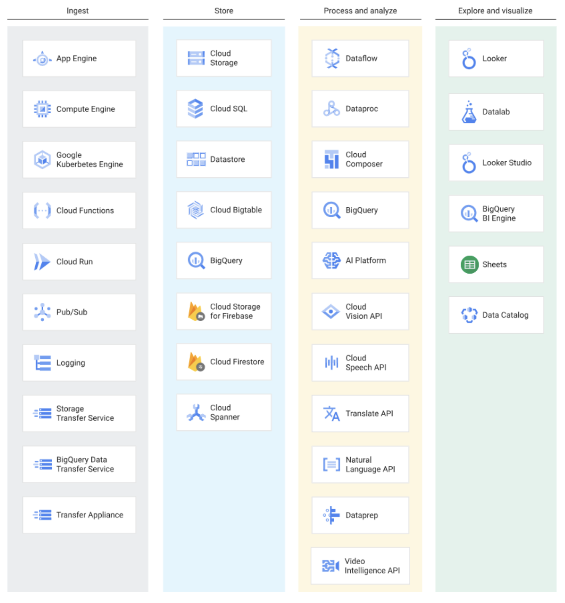

# Data Lifecycle in Data Engineering

1. **Ingest**: pull in the raw data, such as streaming data from devices, on-premises batch data, app
logs, or mobile-app user events and analytics
2. **Store**: the retrieved data needs to be stored in a format that is durable and easily accessible
3. **Process and analyze**: the data is transformed from raw form into actionable information
4. **Explore and visualize**: convert the results of the analysis into a format that is easy to draw
insights from and to share with colleagues

Some of the available services at each step:

*[(Image source)](https://medium.com/google-cloud/bigquery-explained-overview-357055ecfda3)*
