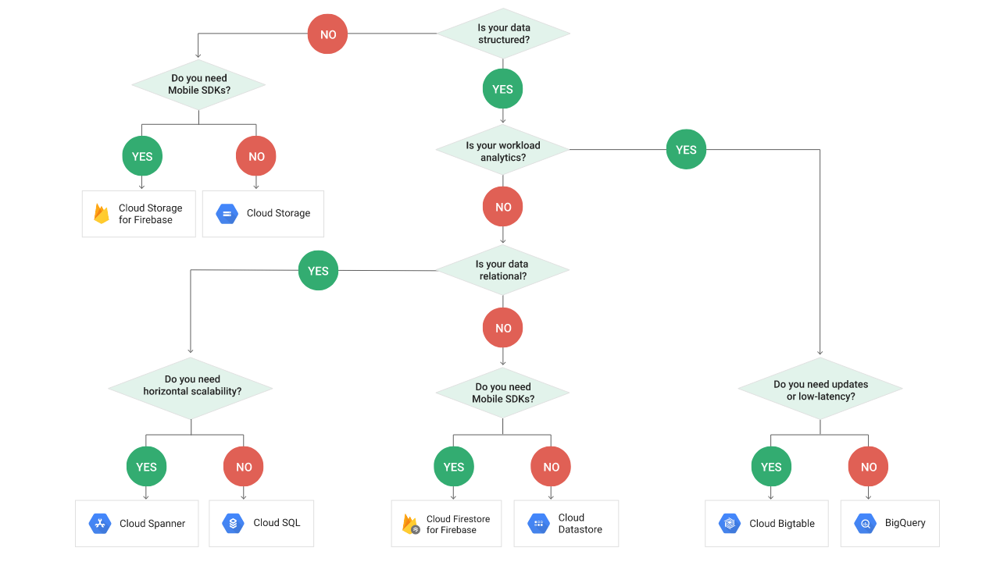

# Storage


*[(Image source)](https://grumpygrace.dev/posts/gcp-flowcharts/)*

<br>
    
## Cloud Storage
- Object (blob) storage
- Content is not indexed
- No capacity or planning required, almost unlimited storage
- Object versioning and retention policy
- Regional, Dual-region or Multi-region (reduce latency and increase redundancy)
- Lifecycle of objects in a bucket can be controlled (delete after X; change class after X)
- Classes:
  - Standard (no min storage duration, no retrieval fees)
  - Nearline (min 1 month of storage duration)
  - Coldline (min 3 months of storage duration)
  - Archive (min 1 year of storage duration)

<br>

## Cloud SQL
- Fully managed
- Can Store up to 30 TB of data
- Can scale up (not horizontally), meaning it adds storage up to 30TB when it
reaches 70% of utilization
- Cloud SQL supports transactions as well as analysis through BI tools
- DB Migration Service (DMS) available, to migrate MySQL to the cloud
- To shift some workloads, read replicas can be made

<br>

## Cloud Spanner
- Spanner = SQL + Horizontal Scalability (performed by increasing nodes)
- Use when data is > 2TB. Each node can store up to 2TB
- High replication possible
- Hotspotting
  - In a distributed database, a hotspot is an overworked node – a part of the database   that's processing a greater share of the total workload than it is meant to handle
  - Hotspotting can occur when sequential values are used as primary keys
  - Introduce more variation in the sort order of primary keys generated in close proximity. Options: using the hash of a natural key; swapping the order of columns in keys to promote higher-cardinality attributes; using a universally unique identifier (UUID)
- Secondary Index
  - Spanner automatically creates an index for each table's primary key.
  - Secondary indexes get explicitly created instead. They are useful when filtering in a query using a WHERE clause: if the column referenced is indexed, the index can be used for filtering rather than scanning the full table and then filtering
  - Use interleaved tables with a parent-child relationship in which parent data is stored with child data. This makes retrieving data from both tables simultaneously more efficient than if the data were stored separately, and is especially helpful when performing joins. Since the data from both tables is co-located, the db has to perform fewer seeks to get all the needed data

<br>

## Cloud SQL vs Cloud Spanner
- Cloud Spanner is used when you need to handle massive amounts of data with an elevated level of consistency and with a big amount of data handling (+100k reads/write per second), but
it’s much more expensive than Cloud SQL
- Choose SQL if you just want to store some data of your customer in a cheap way but still don't want to face server configuration; choose Spanner if you are planning to create a big product or if you want to be ready for a huge increase in users for your application (viral games/apps)

<br>

## BigQuery
- Fully managed Data Warehouse (analytical, not for transactional purposes)
- Alternative to Hadoop with Hive
- Can query TB of data in seconds and PB of data in minutes
- It’s serverless, zero infrastructure management
- Uses SQL, tables have schema
- Avoid joins. The data should be denormalized; can be done with nested and repeated columns
- It is optimized for reads; edits would be very expensive. No prices from data fetched from cache (caching time = 24 hrs). Read costs (in terms of MB) reflect the number of bytes used in each field (reading a field with many characters will cost more than one with few characters)
- Jobs are async tasks that work on the top of tables
- Security can be applied at different levels: project level, dataset level, table level
- Authorized views allow to share query results without giving access to the underlying data
- Can directly run queries on cloud storage. No need for dataflow.
- Maintains a 7 day history of changes so that you can query a point-in-time snapshot of data
- Wildcard tables are used if you want to union all similar tables with similar names
- Types of queries
  - Interactive: query is executed immediately
  - Batch: batches of queries are queued and the query starts when resources are available

### Partitioning
- Dividing a table into segments (partitions) makes it easier to query data, and saves cost and time. Data is stored in physical blocks, each of which holds one partition of data
- If a query uses a qualifying filter on the value of the partitioning column, BigQuery can scan the partitions that match the filter and skip the remaining partitions (process called pruning)
- Once table is created, you cannot change its partitioning attribute
- Partitioning > Table Sharding: When you have multiple wildcard tables, the best option is to shard it into a single partitioned table. Time and cost efficient
- Maximum of 4000 partitions per table

### Clustering
- Can improve performance of aggregate queries (supported only on partitioned tables)
- Data in clustered tables are sorted based on values in one or more columns
- Cluster on columns that have a very high number of distinct values, like userId or transactionId

### Types of Tables
- **Standard tables** are stored in BQ storage in a columnar format. They include:
  - **Tables**: they have a schema and every column has a data type
  - **Table clones**: lightweight, writeable copies of tables. BQ only stores the delta between a table clone and its base table
  - **Table snapshots**: point-in-time copies of tables. They are read-only, but you can restore a table from a table snapshot. They typically use less storage than a full copy of a table
- **External tables** reference data stored outside BQ (from external sources, also known as federated sources). Used when tables are small. As an external data source, the frequently
changing data does not need to be reloaded every time it is updated. Two types:
  - A **permanent table** is a table that is created in a dataset and is linked to your external data source. Because the table is permanent, you can query the table at any time and you can use access controls to share the table with others (they need access to the underlying external data source)
  - A **temporary table** is just linked to the external data source. When you use a temporary table, you do not create a table in one of your BQ datasets, so it cannot be shared with others. Querying an external data source using a temporary table is useful for one-time ad-hoc queries over external data, or for ETL processes
- **Views** are logical tables created by a SQL query. They don’t store any data themselves. This allows you to create a reusable representation of a query result, which you can use as if it was a physical table. They are helpful when you have complex or frequently used queries, as they simplify the process of accessing and querying the underlying data
  - **Materialized views** are precomputed views that periodically cache the results of a query for increased performance and efficiency. BQ leverages these results and whenever possible reads only delta changes from the base tables to compute up-to-date results.

### Special types
- **Record**. Column with nested data, can be accessed as a struct type
- **Repeated**. Column with repeated data, can be accessed as an array type

A Record column can have Repeated mode, which is represented as an array of struct types.\
A field within a record can be repeated, which is represented as a struct that contains an array.\
An array cannot contain another array directly.

### Import data
- You can load data into BQ via two options:
  - batch loading (free). Web console (local files), GCS, GDS
  - streaming (costly). Data with CDF, Cloud logging or POST calls
- When using the Cloud Console, files loaded from a local data source cannot exceed 10 MB
- Can import CSV/JSON/Avro on GCS, Google sheets. Default is CSV. If a CSV is imported without errors, no lines will be skipped; if a line contains an error, the file won’t be imported.
- By default, BQ expects all source data to be UTF-8 encoded
- To support (occasionally) schema changing we can use 'Automatically detect' for schema changes. Automatically detect is not default selected
- BQ Data Transfer Service can only transfer data into BQ, not out of it

### Export data
- Data can only be exported in CSV/JSON/Avro (CSV doesn’t support nested/repeated)
- Up to 1 GB to a single file. To export more, put a wildcard in the destination filename

### Controlling costs
- Avoid `SELECT *` (full scan), select only columns needed.
- Using `LIMIT` is still a full scan
- Preview queries to estimate costs (dry-run)
- Break query results into stages
- Partition data by date
- Use default table expiration to delete unneeded data
- Monitor costs using dashboards and audit logs
- Use streaming inserts wisely
- Use max bytes billed to limit query costs
- Set hard limit on bytes (members) processed per day

### Query performance
- Generally, queries that do less work perform better
- Input Data/Data Sources
  - Avoid `SELECT *`
  - Prune partitioned queries (for time-partitioned table, use PARTITIONTIME pseudo-column to filter partitions)
  - Denormalize data (use nested and repeated fields)
  - Use external data sources appropriately
  - Avoid excessive wildcard tables
- SQL Anti-Patterns
  - Avoid unequally sized partitions (skewed)
  - Avoid self-joins: use window functions
  - Avoid cross-joins (joins that generate more outputs than inputs). Pre-aggregate data or use window function
  - Avoid DML statements that update or insert single rows. Batch your updates and inserts
- Optimizing Query Computation
  - Avoid repeatedly transforming data via SQL queries
  - Use approximate aggregation functions (approx count)
  - Order query operations to maximize performance. Use ORDER BY only in the outermost query, push complex operations to the end of the query
  - Optimize join patterns: when joining multiple tables, start with the largest table

### Pricing models
- On-demand: you are charged for the number of bytes processed by each query. The first TB per month is free
- Flat-rate: you purchase slots, which are dedicated processing capacity that you can use to run queries. Different commitment plans: you commit for 60s (flex slots), monthly or annually.

<br>

## BigTable
- Managed service
- No transactional support, so can handle petabytes of data; not good for data less than 1TB of data or items greater than 10MB
- NoSQL (key/value store). It does not support SQL queries, joins
- Recommended for time-series data, financial data or IOT data, as it is highly scalable
- Tables are sparse. A column doesn't take up any space in a row that doesn't use the column
- Data Replication means copying data across multiple regions to increase durability. Just add another cluster and it will be possible to replicate the data
- No downtime for cluster resize
- During instance creation, clusters can be configured on the number of nodes, SSD or HDD, Regional or Zone etc. The choice of SSD / HDD storage is permanent. To change it, export the
data from the existing instance and import it into a new instance
- BigTable scales linearly. Increasing the number of nodes increases performance
- Mutations or Deletions take extra storage as mutations are stored sequentially, and deletions are just specialized mutations
- Supports backups and garbage collection
- cbt is a tool for doing basic interactions with Cloud Bigtable
- Can use up to around 100 column families
- Field promotion avoids hotspotting
- It is recommended to create your Compute Engine instance in the same zone as your Cloud Bigtable instance for the best possible performance. If it's not possible to create a instance in
the same zone, you should create your instance in another zone within the same region
- The only way to achieve strong consistency in Cloud Bigtable is by having all reads routed from a single cluster and using the other replicas only for failover

### Instances, clusters, nodes
- An instance is mostly just a container for your clusters and nodes, which do all of the real work
- Tables belong to instances, not to clusters or nodes. So if you have an instance with up to 2 clusters, you can't assign tables to individual clusters
- Max 1k tables per instance
- Multi-cluster routing is beneficial in cases where high availability is needed
- Adding more nodes to a cluster (not replication) can improve the write performance
- Google recommends adding nodes when storage utilization is > 70%

### Security
Can manage security at project, instance and table levels, via IAM. For example, you can grant the
ability to read from and write to any table within the project, but not manage instances

### Performance
- Reads / writes should always be evenly distributed: redesign schema otherwise!
- A tall and narrow table (long, few features) makes it easier to run queries on the data
- Key Visualizer is a tool that helps you analyze your Bigtable usage patterns. It generates visual reports for your tables that break down your usage based on the row keys that you access. Goals: improving the design of an existing schema, troubleshooting performance issues

### Row Keys
- Each table has only one index, the row key, and it must be unique. Best Practices:
  - Design your row key based on the queries you will do (low-cardinality first)
  - Avoid using a single row key to identify a value that must be updated very frequently
  - Hashing a row key prevent BigTable to take advantage of its natural sorting order
  - Keep your row keys reasonably short
  - Should not be only timestamp
  - Should not have a timestamp at the start
- Example: “user-id#device-id#activity-id#timestamp”

<br>
    
## Datastore / Firestore
- NoSQL (document-based), but SQL-like query language
- Fully managed with no planned downtime
- ACID transactions
  - Eventually consistent (ensures that entity lookups by key and ancestor queries always receive strongly consistent data; all other queries are eventually consistent)
  - Atomic transactions (if executing a set of operations, either all succeed or none occur)
- Massive (auto) scalability with high performance, thanks to its distributed architecture. It uses indexes and query constraints so queries scale with the size of your result set (not data set)
- Encryption at rest. Cloud Datastore automatically encrypts all data before it is written to disk and automatically decrypts the data when read by an authorized user

### Exploding Index Problem
It can happen in NoSQL dbs that allow flexible schemas and support indexing on various properties, when you create too many composite indexes or indexes on properties with high cardinality. Each index consumes storage and resources, and maintaining a large number can become expensive in terms of storage costs and query performance. Additionally, every update to the indexed data requires updates to the associated indexes, which can lead to increased write latencies
To mitigate the exploding index problem:
- Avoid creating unnecessary indexes on every property, especially if you don't plan to use them for filtering or sorting
- Use composite indexes carefully: they are powerful but single-property index are often enough

Example of a composite index (more than one property for each index):
```
indexes:
  - kind: movie
  - properties:
    - name: actors
    - name: date_released
```
