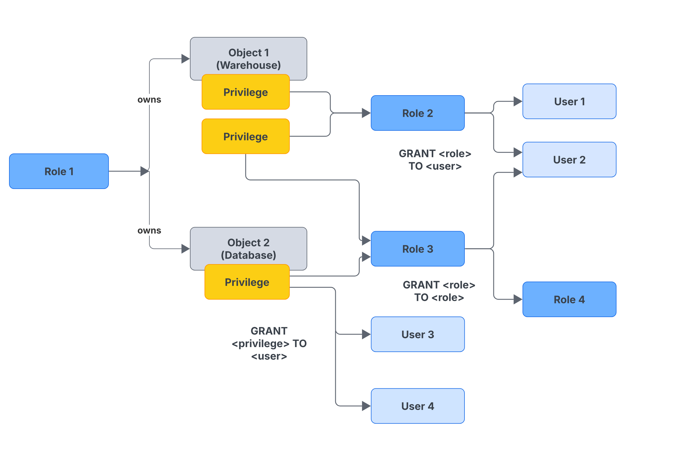
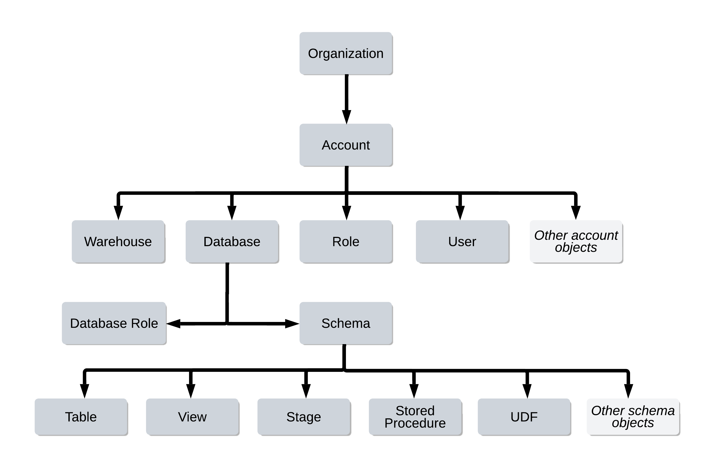
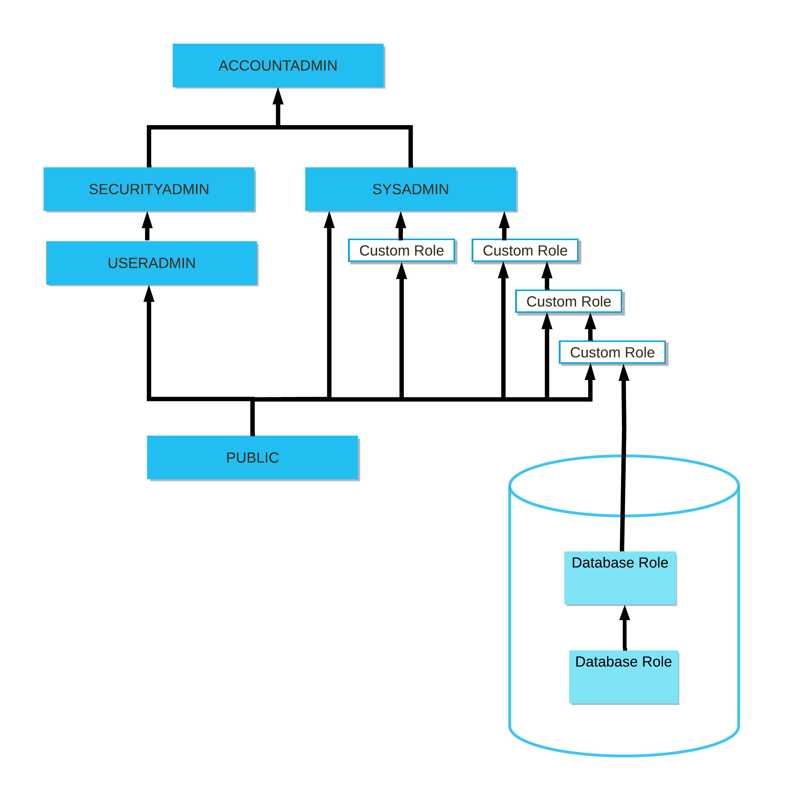

# Access control
[(Docs)](https://docs.snowflake.com/en/user-guide/security-access-control-overview)

## Access control framework

Snowflake’s approach to access control combines aspects from different models, which can be shown in the following image:

- **Discretionary Access Control (DAC)**: Each object has an owner, who can in turn grant access to that object (Role 1 has the OWNERSHIP privilege on both Object 1 and 2)
- **Role-based Access Control (RBAC)**: Access privileges are assigned to roles, which are in turn assigned to users (Privileges on Object 1 can be granted to Role 2, which can then be granted to User 1 and User 2)
- **User-based Access Control (UBAC)**: Access privileges are assigned directly to users. Access control considers privileges assigned directly to users only when USE SECONDARY ROLE is set to ALL. UBAC extends Snowflake access control framework, providing a significant amount of both control and flexibility (Privileges on Object 2 can be granted directly to User 3 and User 4)

## Securable objects
It's an entity to which access can be granted. Unless explicitly allowed by a grant, access is denied. Every securable object resides within a logical container in a hierarchy of containers. The top-most container is the customer organization. Securable objects such as tables, views, functions, and stages are contained in a schema object, which are in turn contained in a database. All databases for your Snowflake account are contained in the account object.

*Hierarchy of objects and containers*

Each securable object is owned by a single role (i.e. the role has the OWNERSHIP privilege on it), which by default is the role used to create the object. When this role is assigned to users, they effectively have shared control over the object. The GRANT OWNERSHIP command lets you transfer the ownership of an object from one role to another.

## Privileges
They determine who can access and perform operations on specific objects.
- for existing objects, privileges must be granted on individual objects (such as the SELECT privilege on a table). 
- for future object created in a schema, future grants allow defining an initial set of privileges (for example, granting the SELECT privilege on all new tables created in a schema to a role).

Privileges are managed using the following command:
`GRANT/REVOKE <privileges> TO ROLE/USER`

This can work differently:
- In regular (non-managed) schemas, use of these commands is restricted to the role that owns an object (has the OWNERSHIP privilege on the object), any roles or users that have the MANAGE GRANTS global privilege for the object (only the SECURITYADMIN role by default).
- In managed access schemas, object owners lose the ability to make grant decisions. Only the schema owner or a role with the MANAGE GRANTS privilege can grant privileges on objects in the schema, including future grants, centralizing privilege management.

## Roles
Roles are the entities to which privileges on securable objects can be granted and revoked. They are assigned to users to allow them to perform actions. Roles can be also granted to other roles, creating a hierarchy of roles. The privileges associated with a role are inherited by any roles above that role in the hierarchy (but if a role owns another role, that doesn't mean it will inherit their privileges). 

### Active roles
A user can be assigned multiple roles. This allows users to switch roles (that is, choose which role is **active** in the current Snowflake session) to perform different actions using separate sets of privileges.

In addition to this active role (called primary), there are **secondary roles**, which are additional roles that can be activated simultaneously with the primary role. When secondary roles are enabled, the user gets the union of privileges from the primary role and all active secondary roles. This can be useful for cases where a user needs access to multiple sets of privileges at the same time (instead of constantly switching roles).

### Types of roles
They vary in their scope, which enable administrators to authorize and restrict access to objects in your account.

| Role Type | Purpose | Notes  |
|-----------|---------|--------|
| **Account Roles** | Permit SQL actions on any object in the account | Directly activated in a session |
| **Database Roles** | Limit SQL actions to a single database and its objects | Cannot be activated directly; must be granted to account roles |
| **Instance Roles** | Permit access to an instance of a class (methods, privileges, etc.) | Cannot be activated directly; must be granted to account roles |
| **Application Roles** | Enable consumer access to objects in a Snowflake Native App | Providers create them. Snowflake may provide **system app roles** for specific features (e.g., Budgets, DMFs) |
| **Service Roles** | Allow access to service endpoints | Can be granted to account roles, application roles, or database roles |

### System-defined roles
- have privileges related to account-management
- cannot be dropped
- have privileges that cannot be revoked
- shouldn't be granted any more privilege (not recommended to mix account-management privileges and entity-specific privileges in the same role; if additional privileges are needed, Snowflake recommends granting the additional privileges to a custom role and assigning the custom role to the system-defined role)

| Role            | Description |
|-----------------|-------------|
| **GLOBALORGADMIN** | Performs organization-level tasks such as managing the lifecycle of accounts and viewing organization-level usage information. Exists only in the organization account.|
| **ORGADMIN**       | Uses a regular account to manage operations at the organization level. This role will be phased out in a future release; organization administrators are encouraged to use **GLOBALORGADMIN** instead. |
| **ACCOUNTADMIN**   | Encapsulates the **SYSADMIN** and **SECURITYADMIN** roles. It is the top-level role in the system and should be granted only to a limited number of users in an account. |
| **SECURITYADMIN**  | Manages object grants globally, and can create, monitor, and manage users and roles.  • Granted the **MANAGE GRANTS** privilege (ability to grant/revoke privileges, but not create objects).  • Inherits **USERADMIN** role privileges via hierarchy. |
| **USERADMIN**      | Dedicated to user and role management.  • Granted **CREATE USER** and **CREATE ROLE** privileges.  • Can create/manage users and roles it owns.  • Only the role with **OWNERSHIP** (or higher) can modify object properties. |
| **SYSADMIN**       | Can create warehouses, databases, and other objects.  If all custom roles are assigned under **SYSADMIN**, it can also grant privileges on those objects to other roles. |
| **PUBLIC**         | Pseudo-role automatically granted to every user and role. Can own securable objects, which are accessible to all users/roles. Typically used when explicit access control is not needed. |

### Custom roles
Can be created using the USERADMIN role (or a higher role) as well as by any role to which the CREATE ROLE privilege has been granted. Custom database roles can be created by the database owner (that is, the role that has the OWNERSHIP privilege on the database).

By default, a newly-created role is not assigned to any user, nor granted to any other role.

When creating roles that will serve as the owners of securable objects in the system, it's recommended to create a hierarchy of custom roles, with the top-most custom role assigned to the system role SYSADMIN. This role structure allows system administrators to manage all objects in the account, such as warehouses and database objects, while restricting management of users and roles to the USERADMIN role.

## Role hierarchy and privilege inheritance

Note: ORGADMIN is a separate system role that manages operations at the organization level. This role is not included in the hierarchy of system roles

