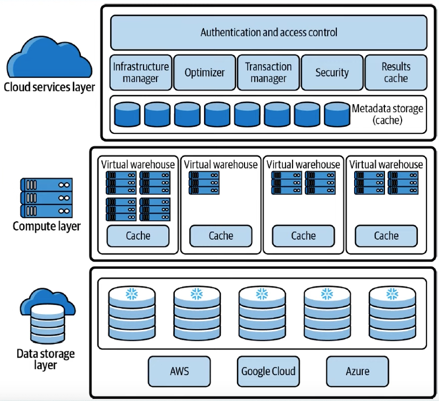

# Snowflake Key Concepts & Architecture
[(Docs)](https://docs.snowflake.com/en/user-guide/intro-key-concepts)

Snowflake’s **Data Cloud** is built on an advanced data platform delivered as a **self-managed service**, offering faster, easier, and more flexible solutions for data storage, processing, and analytics than traditional systems.

Unlike legacy database technologies or Hadoop-based platforms, Snowflake is built from the ground up with:
- A new SQL query engine
- A cloud-native architecture

## Data Platform as a Self-managed Service

Snowflake is a **true self-managed service**, meaning:
- No hardware (virtual or physical) to install or manage
- Minimal software to configure
- Automatic maintenance, upgrades, and tuning by Snowflake

It runs entirely on **public cloud infrastructure**, so it cannot run on private clouds or on-premises. It's not a packaged software product — Snowflake manages installation and updates. It uses **virtual compute instances** for processing and **cloud storage services** for persistent storage.

## Architecture

Snowflake’s architecture is a hybrid of more traditional
- **shared-disk** database architectures; uses a central data repository for persisted data that is accessible from all compute nodes in the platform (benefit: **data management simplicity**)
- **shared-nothing** database architecture; processes queries using MPP (massively parallel processing) compute clusters where each node in the cluster stores a portion of the entire data set locally (benefit: **performance and scale-out**)

Snowflake’s unique architecture consists of three key **layers**:

1. **Database Storage**  
   - Data is stored in **cloud storages** managed entirely by Snowflake (e.g. S3)
   - Data is reorganized into an **optimized, compressed, columnar format**.
   - Snowflake handles file size, structure, compression, metadata, and statistics.
   - Data is not directly accessible; it is only queried via **SQL operations**.

2. **Query Processing**  
   - Queries are executed by **virtual warehouses** (independent MPP compute clusters).
   - Each virtual warehouse:
     - Uses multiple compute nodes provisioned from the cloud.
     - Operates independently, ensuring **no performance interference** across clusters.

3. **Cloud Services**  
   - Coordinates all platform activities (from login to query execution).
   - Runs on compute instances provisioned by Snowflake.
   - Key services include:
     - Authentication
     - Infrastructure management
     - Metadata management
     - Query parsing & optimization
     - Access control

## Connecting to Snowflake

Snowflake supports multiple ways of connecting to the service:
- A web-based user interface from which all aspects of managing and using Snowflake can be accessed.
- Command line clients (e.g. SnowSQL) which can also access all aspects of managing and using Snowflake.
- ODBC and JDBC drivers that can be used by other applications (e.g. Tableau) to connect to Snowflake.
- Native connectors (e.g. Python, Spark) that can be used to develop applications for connecting to Snowflake.
- Third-party connectors that can be used to connect applications such as ETL tools (e.g. Informatica) and BI tools (e.g. ThoughtSpot) to Snowflake.
