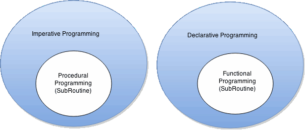

# Programming paradigms

TODO: ADD STUFF FROM HERE https://stackoverflow.com/questions/10925689/functional-programming-vs-declarative-programming-vs-imperative-programming

They describe coding on different levels of abstraction: 
- declarative -> concerned with what to do, not how to do it
- imperative -> concerned with how to do it, not what to do

Declarative programming is on a higher level of abstraction than imperative programming. 

The concept of functional and procedural programming paradigms are really just extensions of the concept of declarative and imperative programming paradigms. 



<br>

## Functional vs procedural

### Subroutines
Both functional and procedural programming have some kind of subroutines: one uses **functions**, the other **procedures**.

Subroutines that are used for re-executing a predefined block of code. The difference between them is that functions return a value, and procedures do not. More specifically, functions are designed to have minimal side effects, and always produce the same output when given the same input. Furthermore, functions are usually concerned with higher level ideas and concepts. Procedures on the other hand do not have any return value, their primary purpose is to accomplish a given task and cause a desired side effect. 

An example for this is looping:
- in procedural languages it's done via a for/while/foreach loop, a subroutine whose main purpose is to cause side effects, and it does not return a value in of itself
    ```
    function printArray(A):
        for (i = 0; i < 10; i++) 
            print(A[i])
    ```
- a purely functional language will not have any loop functionality; looping will be done via recursion.:
    ```
    function printArray(A):
        if (A != [])
            print(head(A))   // print 1st element
            printArray(tail(A))   // run function on A minus its first element
    ```

### Coding style
Procedural languages are generally more imperative. There are more lines which can be described as "step-by-step commands", whereas in a functional language you will generally do things in "one fell swoop". For example, to filter an array to include only multiples of 2, procedurally I might proceed like
```
AFiltered = []
for (i = 0; i < A.length; i++)
    if (A[i] % 2 == 0)
        AFiltered.push(A[i])
```
but in functional programming we can utilise nice functions like filter:
```
AFiltered = filter(A, (a) => a % 2 == 0)
```

### Objects
Data structures in procedural languages are generally mutable, which means they can be changed. Most functional languages don't allow you to change an object or variable after it has been created.
