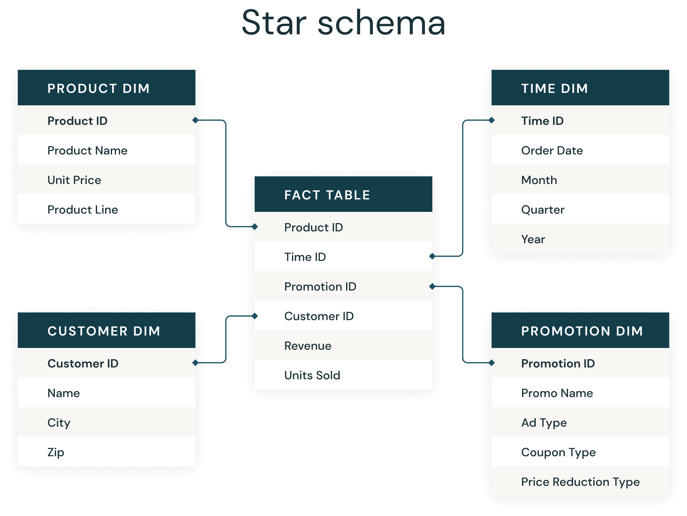
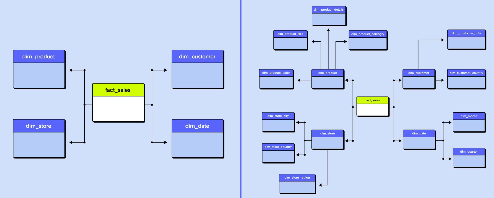

# Data modeling

https://www.datacamp.com/blog/data-modeling

https://agiledata.org/essays/datamodeling101.html

## Normalization vs denormalization

aaa

## Star schema

Introduced by Ralph Kimball in the 1990s, a star schema is a multi-dimensional data model used to organize data in a database so that it is easy to understand and analyze. 
The star schema design is optimized for querying large data sets, maintaining history, and updating data by reducing the duplication of repetitive business definitions, making it fast to aggregate and filter data in the data warehouse (or data mart).

A star schema has a single fact table in the center, containing business "facts" (like transaction amounts and quantities). The fact table connects to multiple other dimension tables along "dimensions" like time, or product. Star schemas enable users to slice and dice the data however they see fit, typically by joining two or more fact tables and dimension tables together.

Star schemas denormalize data, which means adding redundant columns to some dimension tables to make querying and working with the data faster and easier. The purpose is to trade some redundancy (duplication of data) in the data model for increased query speed, by avoiding computationally expensive join operations. In this model, the fact table is normalized but the dimensions tables are not. That is, data from the fact table exists only on the fact table, but dimensional tables may hold redundant data.

### Facts vs dimensions

**Fact tables** record measurements or metrics for a specific event. Fact tables generally consist of numeric values, and foreign keys to dimensional data where descriptive information is kept. Fact tables are designed to a low level of uniform detail (granularity), meaning facts can record events at a very atomic level. This can result in the accumulation of a large number of records in a fact table over time. Fact tables are defined as one of three types:
- Transaction fact tables record facts about a specific event (e.g., sales events)
- Snapshot fact tables record facts at a given point in time (e.g., account details at month end)
- Accumulating snapshot tables record aggregate facts at a given point in time (e.g., total month-to-date sales for a product)

Fact tables are generally assigned a surrogate key to ensure each row can be uniquely identified. This key is a simple primary key.

**Dimension tables** usually have a relatively small number of records compared to fact tables, but each record may have a very large number of attributes to describe the fact data. Dimensions can define a wide variety of characteristics, but some of the most common attributes defined by dimension tables include:

- Time dimension tables describe time at the lowest level of time granularity for which events are recorded in the star schema
- Geography dimension tables describe location data, such as country, state, or city
- Product dimension tables describe products
- Employee dimension tables describe employees, such as sales people
- Range dimension tables describe ranges of time, dollar values or other measurable quantities to simplify reporting

Dimension tables are generally assigned a surrogate primary key, usually a single-column integer data type, mapped to the combination of dimension attributes that form the natural key.

## Snowflake schema

"Snowflaking" is a method of normalizing the dimension tables in a star schema. When it is completely normalized along all the dimension tables, the resultant structure resembles a snowflake with the fact table in the middle. The principle behind snowflaking is normalization of the dimension tables by removing low cardinality attributes and forming separate tables.

The snowflake schema is similar to the star schema. However, in the snowflake schema, dimensions are normalized into multiple related tables, whereas the star schema's dimensions are denormalized with each dimension represented by a single table. A complex snowflake shape emerges when the dimensions of a snowflake schema are elaborate, having multiple levels of relationships, and the child tables have multiple parent tables ("forks in the road").

Star and snowflake schemas are most commonly found in dimensional data warehouses and data marts where speed of data retrieval is more important than the efficiency of data manipulations. As such, the tables in these schemas are not normalized much, and are frequently designed at a level of normalization short of third normal form.

## Slowly Changing Dimensions (Type 1 vs Type 2)

aaa

