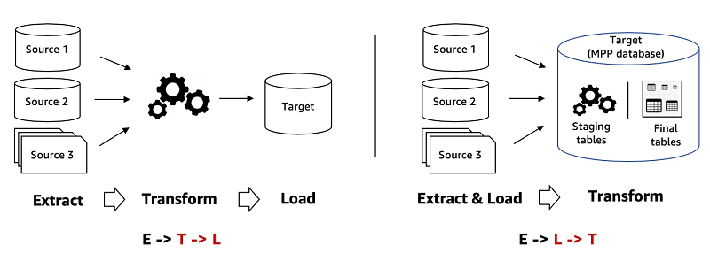

# Data pipelines

## ETL and ELT
They are two data-processing approaches for analytics. Large organizations have several hundred (or even thousands) of data sources from all aspects of their operations—like applications, sensors, IT infrastructure, and third-party partners. They have to filter, sort, and clean this large data volume to make it useful for analytics and business intelligence. The ETL approach uses a set of business rules to process data from several sources before centralized integration.

Both are composed of three steps:
- **Extraction** is the (first) step, about collecting raw data from different sources. These could be databases, files, software as a service (SaaS) applications, Internet of Things (IoT) sensors, or application events. You can collect semi-structured, structured, or unstructured data at this stage.
- **Transformation** is the second step in ETL and third step in ELT. It focuses on changing raw data from its original structure into a format that meets the requirements of the target system where you plan to store the data for analytics. Here are some examples of transformation:
    - Changing data types or formats
    - Removing inconsistent or inaccurate data.
    - Removing data duplication.
    You apply rules and functions to clean and prepare data for analysis in the target system.
- **Load** is the third step in ETL and second step in ELT. In this phase, you store data into the target database. 

### Key differences

| Aspect | ETL | ELT |
| ------ | --- | --- |
| Transform and load location | Data is transformed before loading, on a secondary processing server. The transformation stage ensures compliance with the target database’s structural requirements. You only move the data once it is transformed and ready. | Raw data is loaded directly into the target data warehouse, then transformed. You can interact with and transform the raw data as many times as needed |
| Data compatibility | Primarily structured, tabular data with rows and columns. It transforms one set of structured data into another structured format and then loads it. | Structured and unstructured data (e.g., images, documents) |
| Performance        | Slower and harder to scale due to pre-load processing    | Faster; leverages cloud warehouse parallel processing     |
| Cost & complexity  | Higher setup and infrastructure costs                    | Simpler stack with lower setup and maintenance costs      |
| Security           | Requires custom solutions for PII protection             | Built-in warehouse security (access control, MFA, etc.)   |
| Use cases | Highly structured, stable reporting, Strict data governance or compliance, Legacy or on-prem systems, Low volume & predictable pipelines, Complex transformations requiring custom logic | Cloud-native analytics platforms, Mixed or evolving data sources, Exploratory analytics and data science, Near real-time or high-volume data ingestion |

ETL has been around since the 1970s, becoming especially popular with the rise of data warehouses. However, traditional data warehouses required custom ETL processes for each data source. The evolution of cloud technologies changed what was possible. Companies could now store unlimited raw data at scale and analyze it later as required. ELT became the modern data integration method for efficient analytics.

## Idempotency
Idempotency means that if you perform the same action multiple times, you get the same result every time. Why does it matter?
- **avoiding duplicate data**: duplicate records can cause confusion for users, blow up storage costs, and corrupt analytical results. Idempotent data pipelines help guarantee that running the same task more than once won’t multiply your data, and on the other hand will increase consistenc and integrity.
- **recovering from failures**: you can safely rerun an idempotent task after a failure (networks glitch out, servers crash, or the code hits a corner case you didn’t see coming) without worrying that you’ll break anything else or create even more problems.
- **simplifying development**: when you know a job can be safely retried, it takes a lot of pressure off the engineering team. You don’t have to write as many complex “cleanup” routines to deal with halfway-finished jobs.

Idempotency can be implemented with:
- Delete-Write (Truncate/Overwrite): Fully replaces existing data to guarantee consistency, at the cost of higher compute and I/O for large datasets.
- Upserts (Insert + Update): Uses unique keys to insert new records or update existing ones, enabling efficient incremental processing.
- Detailed Logs / Metadata Tracking: Records batch or processing metadata to detect what has already been processed and safely skip or reprocess data.
