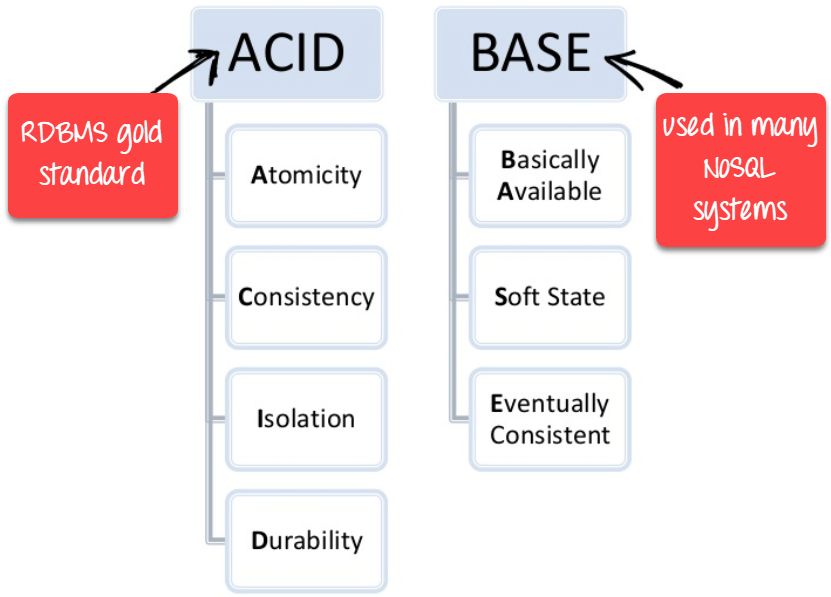
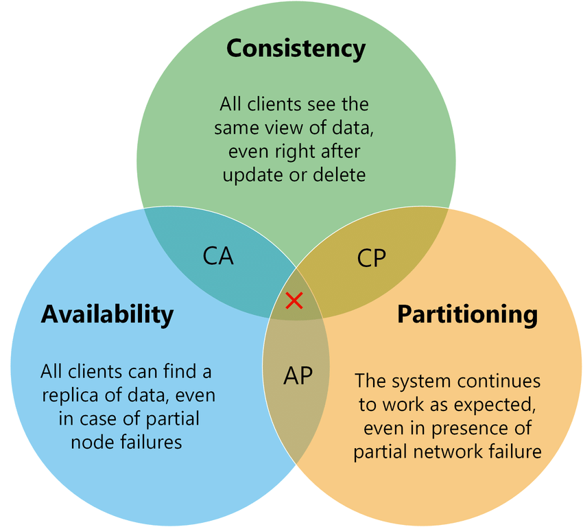

# ACID, BASE, CAP

In the context of databases and data storage systems, a **transaction** is any operation that is treated as a single unit of work, which either completes fully or does not complete at all, and leaves the storage system in a consistent state. The classic example of a transaction is what occurs when you withdraw money from your bank account. Either the money has left your bank account, or it has not — there cannot be an in-between state.

 

## Overview

ACID and BASE are acronyms for different database properties representing how the database behaves during online transaction processing. 
- **ACID** databases prioritize consistency over availability: the whole transaction fails if an error occurs in any step within the transaction
- **BASE** databases prioritize availability over consistency: instead of failing the transaction, users can access inconsistent data temporarily. Data consistency is achieved, but not immediately

 

## CAP theorem

Modern databases are distributed data stores that replicate data across multiple nodes connected by a network. They allow users to perform multiple data manipulations like reads and writes in a single transaction. Users expect data to remain consistent across all nodes at the end of the transaction. However, in theoretical computer science, Brewer's theorem (also called CAP theorem) states that any distributed data store can provide only two of the following three guarantees:

- **Consistency**: every read operation receives the most recently updated data or an error.
- **Availability**: every database request receives a successful response, without guaranteeing it contains the most recently updated data.
- **Partition tolerance**: the system continues to operate despite dropped or delayed messages between the distributed nodes.

For example, if a customer adds an item to a cart on an ecommerce website, all other customers should see the stock levels of the product drop. If the customer adds the last item to the cart, all other users should see the item as out of stock. In case any operation fails within a transaction, database designers must make a choice. The database can do one of the following:

- Cancel the transaction and return an error, decreasing availability but ensuring consistency. The customer cannot add the item to their cart or other customers cannot load the details for all products until add to cart succeeds.
- Proceed with the operation and thus provide availability but risk inconsistency. The customer adds an item to the cart, but other customers view incorrect stock levels, at least temporarily.

In some use cases, consistency is critical and ACID databases are favored. However, there are other use cases where it is non-critical. For example, when you accept a friend request on social media, it doesn't matter if other users see an incorrect number of friends on your social media profile temporarily. However, you don't want to lose access to your social media feed while the data is sorted. In such scenarios, BASE becomes important.

 

## ACID
### Atomicity
ach statement in a transaction (to read, write, update or delete data) is treated as a single unit. Either the entire statement is executed, or none of it is executed. This property prevents data loss and corruption from occurring if, for example, if your streaming data source fails mid-stream.
### Consistency
Ensures that transactions only make changes to tables in predefined, predictable ways. Transactional consistency ensures that corruption or errors in your data do not create unintended consequences for the integrity of your table.

### Isolation
When multiple users are reading and writing from the same table all at once, isolation of their transactions ensures that the concurrent transactions don't interfere with or affect one another. Each request can occur as though they were occurring one by one, even though they're actually occurring simultaneously.

### Durability
Ensures that changes to your data made by successfully executed transactions will be saved, even in the event of system failure.

 

## BASE

### Basically available
It's the database’s concurrent accessibility by users at all times. One user doesn’t need to wait for others to finish the transaction before updating the record. For example, during a sudden surge in traffic on an ecommerce platform, the system may prioritize serving product listings and accepting orders. Even if there is a slight delay in updating inventory quantities, users continue to check out items.

### Soft state
The database's state can change over time, even without external triggers or inputs. Inconsistency is tolerated, and the database is not necessarily in a consistent state at all times. For example, if users edit a social media post, the change may not be visible to other users immediately. However, later on, the post updates by itself (reflecting the older change) even though no user triggered it.

### Eventually consistent
Eventually consistent means the record will achieve consistency when all the concurrent updates have been completed. At that point, applications querying the record will see the same value. For example, consider a distributed document editing system where multiple users can simultaneously edit a document. If User A and User B both edit the same section of the document simultaneously, their local copies may temporarily differ until the changes are propagated and synchronized. However, over time, the system ensures eventual consistency by propagating and merging the changes made by different users.

 

## Can a database be both ACID and BASE?
According to the CAP theorem, a database can satisfy two of the three guarantees of consistency, availability, and partition tolerance. Both ACID and BASE database models provide partition tolerance, so they cannot be both highly consistent and always available. So, a database either leans towards ACID or BASE, but it cannot be both.

For example, SQL databases are structured over the ACID model, while NoSQL databases use the BASE architecture. Some NoSQL databases might exhibit certain ACID traits, but they can’t operate as ACID-compliant databases.

 

## Trade-offs
|                       | **ACID**         | **BASE**              |
|-----------------------|------------------|-----------------------|
| **Scale**             | Harder to scale due to strict consistency; only one transaction per record at a time, which makes horizontal scaling more challenging | Easier to scale horizontally because it doesn’t need to maintain strict consistency; adding multiple nodes across the database cluster allows to improve its data availability (core principle of its architecture) |
| **Flexibility**       | Less flexible; immediate consistency requirement can restrict application access during failures or concurrent updates | More flexible; allows applications to modify records when available without strict consistency constraints |
| **Performance**       | May suffer performance issues with large data volumes or many concurrent requests due to strict ordering and transaction overhead | Higher performance as applications can access and modify records without waiting; improves throughput |
| **Synchronization**   | Requires strict synchronization and locking to ensure consistency; locks records until transactions complete or abort | Uses eventual consistency without locks; synchronization happens over time, accepting potential temporary inconsistencies |

Despite their differences and trade-offs, both ACID and BASE database systems are relevant in different applications. ACID is the ideal option for enterprise applications that require data consistency, reliability, and predictability. For example, banks use an ACID database to store customer transactions because data integrity is the top priority. Meanwhile, BASE databases are a better option for online analytical processing of less structured, high-volume data. For example, ecommerce websites use BASE databases to update product prices, which change frequently. In this case, pricing accuracy is less vital than allowing all customers real-time access to the product price.