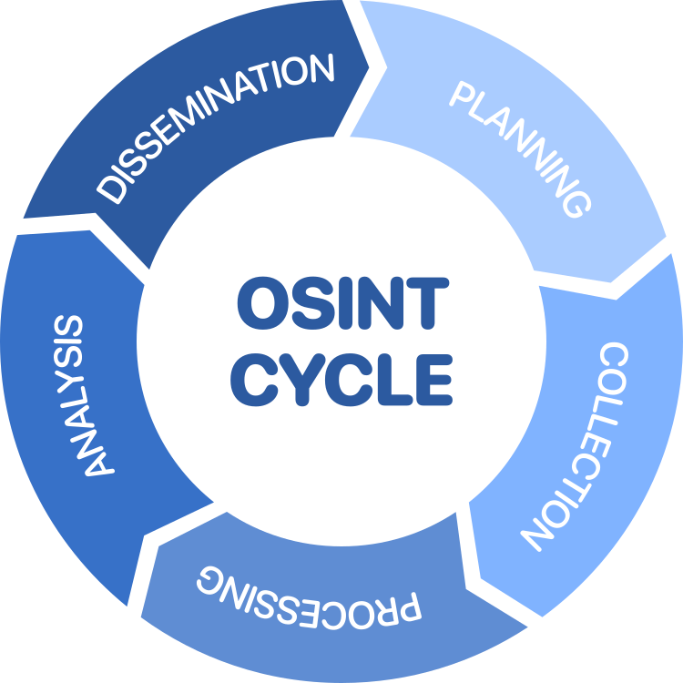

# 1. OSINT Introduction

OSINT (Open Source Intelligence) involves gathering information on people, businesses, and other targets using publicly available data and various methodologies.

All information collected **must** be publicly available and legally accessible.

## Course Scope
Notes based on:
- [Open-Source Intelligence (OSINT) in 5 Hours - Full Course](https://www.youtube.com/watch?v=qwA6MmbeGNo)

The **primary focus** is collection methodologies (2nd step); there's also a brief introduction to analysis and reporting. Not covered in depth: full exploitation, advanced production techniques.

## The intelligence life cycle

### 1. Planning & Direction
- Define the 5 W (who, what, when, where, why)
  - e.g. Who are we targeting? Why are we targeting them? When will we conduct the investigation?
- Set clear objectives and scope
- Determine targets

### 2. Collection
- Gathering the actual information
- Methods include:
  - Image analysis
  - Data gathering from social media
  - Public records searches
  - Technical reconnaissance

### 3. Processing & Exploitation
- Taking collected data and beginning to interpret it
- Organizing raw information
- Initial analysis and filtering

### 4. Analysis & Production
- Deep analysis of processed data
- Connecting data points together
- Building the narrative and context
- Creating intelligence products:
  - Reports
  - Briefings
  - Dashboards

### 5. Dissemination
- Presenting findings to clients/customers
- Ensuring the audience can understand the information
- Delivering actionable intelligence

## Important Notes

The cycle is never-ending, and doesn't have to follow strict order. It's an **iterative process:** you can move between phases as needed (e.g. during collection, you might realize you need more planning - go back and adjust; while processing, you might need to collect more data for verification; etc.).

