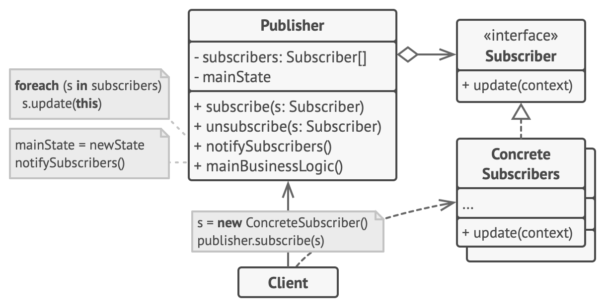

# Behavioral design patterns
They take care of effective communication and the assignment of responsibilities between objects.

## Chain of Responsibility
Lets you pass requests along a chain of handlers. Upon receiving a request, each handler decides either to process the request or to pass it to the next handler in the chain.

### 🚨 The problem
aaa

### ✅ The solution
aaa

### 🛠️ Structure
aaa

### ⚖️ Drawbacks
aaa

 

## Command
Turns a request into a stand-alone object that contains all information about the request. This transformation lets you pass requests as a method arguments, delay or queue a request’s execution, and support undoable operations.

### 🚨 The problem
aaa

### ✅ The solution
aaa

### 🛠️ Structure
aaa

### ⚖️ Drawbacks
aaa

 

## Iterator
Lets you traverse elements of a collection without exposing its underlying representation (list, stack, tree, etc.).

### 🚨 The problem
aaa

### ✅ The solution
aaa

### 🛠️ Structure
aaa

### ⚖️ Drawbacks
aaa

 

## Mediator
Lets you reduce chaotic dependencies between objects. The pattern restricts direct communications between the objects and forces them to collaborate only via a mediator object.

### 🚨 The problem
aaa

### ✅ The solution
aaa

### 🛠️ Structure
aaa

### ⚖️ Drawbacks
aaa

 

## Memento
Lets you save and restore the previous state of an object without revealing the details of its implementation.

### 🚨 The problem
aaa

### ✅ The solution
aaa

### 🛠️ Structure
aaa

### 💡 Applicability
aaa

### ⚖️ Drawbacks
aaa

 

## Observer
Lets you define a subscription mechanism to notify multiple objects about any events that happen to the object they’re observing.

### 🚨 The problem
Imagine a customer eagerly awaiting a new iPhone at a store. They could check the store daily, often in vain, or the store could send frequent notifications to all customers, annoying those not interested. This creates a conflict: either the customer wastes time checking, or the store wastes resources and risks spamming uninterested customers.

### ✅ The solution
The object that has some interesting state is called **publisher**; all other objects that want to track changes to the publisher’s state are called **subscribers**. This pattern suggests adding a subscription mechanism to the publisher class, so individual objects can subscribe to or unsubscribe from a stream of events coming from that publisher.

Whenever an event happens to the publisher, it goes over its subscribers and calls the specific notification method on their objects. Publisher doesn't need to know much about subscribers different classes: so it's crucial that they implement the same interface (with notification method and a set of parameters), and that the publisher communicates with them only via that interface. 

If you have multiple publisher, even them can implement same interface, so that subscribers can observe them with same methods.

### 🛠️ Structure

- The Publisher issues events of interest to other objects. These events occur when the publisher changes its state or executes some behaviors. Publishers contain a subscription infrastructure that lets new subscribers join and current subscribers leave the list
- When a new event happens, the publisher goes over the subscription list and calls the notification method declared in the subscriber interface on each subscriber object.
- The Subscriber interface declares the notification interface. In most cases, it consists of a single update method. The method may have several parameters that let the publisher pass some event details along with the update.
- Concrete Subscribers perform some actions in response to notifications issued by the publisher. All of these classes must implement the same interface so the publisher isn’t coupled to concrete classes.
- Usually, subscribers need some contextual information to handle the update correctly. For this reason, publishers often pass some context data as arguments of the notification method. The publisher can pass itself as an argument, letting subscriber fetch any required data directly.

### 💡 Applicability
Use the Observer pattern when:
- changes to the state of one object may require changing other objects, and the actual set of objects is unknown beforehand or changes dynamically
- some objects in your app must observe others, but only for a limited time or in specific cases

### ⚖️ Pros & Cons
| Pros | Cons |
| ---- | ---- |
| Open/Closed Principle. You can introduce new subscriber classes without having to change the publisher’s code (and vice versa if there’s a publisher interface) | Subscribers are notified in random order |
| You can establish relations between objects at runtime |  |

 

## State
Lets an object alter its behavior when its internal state changes. It appears as if the object changed its class.

### 🚨 The problem
aaa

### ✅ The solution
aaa

### 🛠️ Structure
aaa

### ⚖️ Drawbacks
aaa

 

## Strategy
Lets you define a family of algorithms, put each of them into a separate class, and make their objects interchangeable.

### 🚨 The problem
aaa

### ✅ The solution
aaa

### 🛠️ Structure
aaa

### ⚖️ Drawbacks
aaa

 

## Template Method
Defines the skeleton of an algorithm in the superclass but lets subclasses override specific steps of the algorithm without changing its structure.

### 🚨 The problem
aaa

### ✅ The solution
aaa

### 🛠️ Structure
aaa

### 💡 Applicability
aaa

### ⚖️ Pros & Cons
| Pros | Cons |
| ---- | ---- |
| aaaa | aaaa |

 

## Visitor
Lets you separate algorithms from the objects on which they operate.

### 🚨 The problem
aaa

### ✅ The solution
aaa

### 🛠️ Structure
aaa

### ⚖️ Drawbacks
aaa

 

---

Images sources: https://refactoring.guru/design-patterns/
