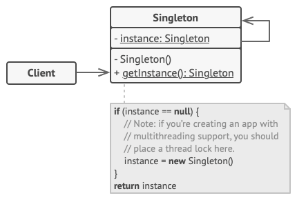
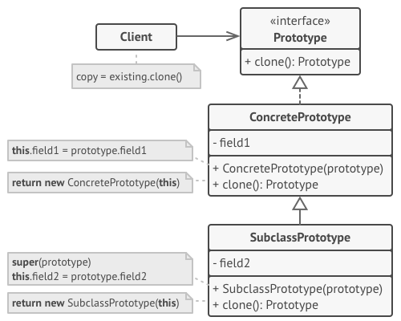
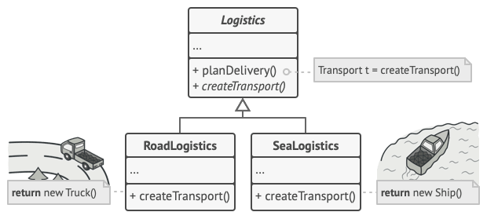
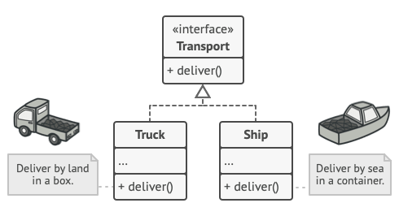
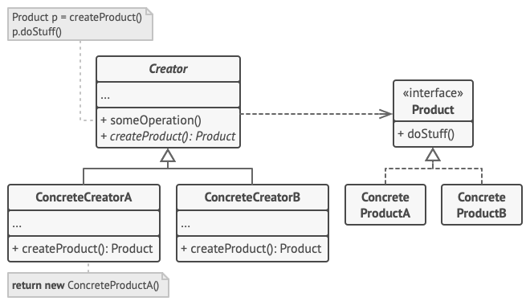

# Creational design patterns
Creational patterns provide flexibility in *what* gets created, *who* creates it, *how* it's created, and *when*. They abstract the instantiation process, making systems independent of how objects are created, composed, and represented.

 

## Singleton
Ensure a class has **only one instance** and provide a **global point of access** to it.

### 🚨 The problem
- Ensure that a class has just a single instance (common reason for this is to control access to some shared resource—for example, a logger, a database, a file, etc.)
- Provide a global access point to that instance. Global variables are very handy, but also very unsafe, since any code can potentially overwrite the contents of those variables and crash the app. This pattern lets you access some object from anywhere in the program. However, it also protects that instance from being overwritten by other code.

### ✅ The solution
All implementations of the Singleton have these two steps in common:
- Make the default constructor private, to prevent other objects from using the `new` operator with the Singleton class.
- Create a static creation method that acts as a constructor. Under the hood, this method calls the private constructor to create an object and saves it in a static field. All following calls to this method return the cached object.

### ⚖️ Drawbacks
- Singleton is often considered an **anti-pattern**, because it creates a global state and hidden dependencies, making code harder to test (many test frameworks rely on inheritance when producing mock objects), to understand (because of hidden dependencies), to parallelize (because of shared state) and more coupled. **Dependency injection** is often a better alternative.
- It solves two problems at the time, violating the Single Responsibility Principle.
- It requires special treatment in a multithreaded environment so that multiple threads won’t create a singleton object several times

 

## Prototype
(aka Clone) Lets you copy existing objects without making your code dependent on their classes.

### 🚨 The problem
Copying an object by creating a new instance and manually copying its fields seems straightforward, but it has limitations. Private fields may not be accessible, making a full copy impossible from outside the object. In addition, this approach tightly couples the code to a concrete class, which is problematic when only an interface is known rather than the actual implementation.

### ✅ The solution
The pattern delegates the cloning process to the actual objects that are being cloned, by declaring a common interface for objects that support cloning (usually such interface contains just a single clone method). This avoids coupling code to the class of that object, i.e. your code shouldn’t depend on the concrete classes of objects that you need to copy.

An object that supports cloning is called a prototype. Its clone method creates an object of the current class and carries over all of the field values of the old object into the new one. 

When your objects have dozens of fields and hundreds of possible configurations, cloning them might serve as an **alternative to subclassing**: instead of having multiple dummy subclasses that match some configuration, the client can simply look for an appropriate prototype and clone it.

Also, prototyping can avoid creation of new objects, which sometimes can be expensive (complex initialization, database queries, network calls)

### ⚖️ Drawbacks
- Cloning complex objects that have circular references might be very tricky
- Avoidable when object creation is cheap & simple or when objects contain unique resources

 

## Factory Method
**Provides an interface for creating objects in a superclass, but allows subclasses to alter the type of objects that will be created.**

### 🚨 The problem
Imagine that you’re creating a logistics management application. The first version of your app can only handle transportation by trucks, but ater a while your app becomes popular, and you receive requests from sea transportation companies to incorporate sea logistics into the app.

At present, most of your code is coupled to the `Truck` class. Adding `Ships` into the app would require making changes to the entire codebase. Moreover, if later you decide to add another type of transportation to the app, you will probably need to make all of these changes again.

### ✅ The solution
This pattern suggests that you replace direct object construction calls (using the new operator) with calls to a special factory method. The objects are still created via the new operator, but it’s being called from within the factory method. Objects returned by a factory method are often referred to as products.

Creator classes:

Product classes:

The code that uses the factory method (often called the client code) doesn’t see a difference between the actual products returned by various subclasses. The client treats all the products as abstract Transport. The client knows that all transport objects are supposed to have the deliver method, but exactly how it works isn’t important to the client.

### 🛠️ Structure

- The `Product` interface is common to all objects that can be produced by the creator and its subclasses.
- `Concrete Products` are different implementations of the product interface.
- The `Creator` class declares the factory method that returns new product objects. It’s important that the return type of this method matches the product interface. You can declare the factory method as abstract to force all subclasses to implement their own versions of the method. As an alternative, the base factory method can return some default product type. Note, despite its name, product creation is not the primary responsibility of the creator. Usually, the creator class already has some core business logic related to products. The factory method helps to decouple this logic from the concrete product classes. Here is an analogy: a large software development company can have a training department for programmers. However, the primary function of the company as a whole is still writing code, not producing programmers
- `Concrete Creators` override the base factory method so it returns a different type of product. Note that the factory method doesn’t have to create new instances all the time. It can also return existing objects from a cache, an object pool, or another source.

### 💡 Applicability
Use the Factory Method when:
- you don’t know beforehand the exact types and dependencies of the objects your code should work with
- you want to provide users of your library or framework with a way to extend its internal components
- you want to save system resources by reusing existing objects instead of rebuilding them each time

### ⚖️ Pros & Cons
| Pros | Cons |
| ---- | ---- |
| Avoids tight coupling between the creator and the concrete products | The code may become more complicated since you need to introduce a lot of new subclasses to implement the pattern. The best case scenario is when you’re introducing the pattern into an existing hierarchy of creator classes. |
| Single Responsibility Principle: you can move the product creation code into one place in the program, making the code easier to support |  |
| Open/Closed Principle: you can introduce new types of products into the program without breaking existing client code |  |

 

## Builder
**Lets you construct complex objects step by step. The pattern allows you to produce different types and representations of an object using the same construction code.**

### 🚨 The problem
aaa

### ✅ The solution
aaa

### 🛠️ Structure
aaa

### 💡 Applicability
aaa

### ⚖️ Pros & Cons
| Pros | Cons |
| ---- | ---- |
| aaaa | aaaa |

 

## Abstract Factory
**Lets you produce families of related objects without specifying their concrete classes.**

### 🚨 The problem
aaa

### ✅ The solution
aaa

### 🛠️ Structure
aaa

### 💡 Applicability
aaa

### ⚖️ Pros & Cons
| Pros | Cons |
| ---- | ---- |
| aaaa | aaaa |

 

---

Images sources: https://refactoring.guru/design-patterns/
