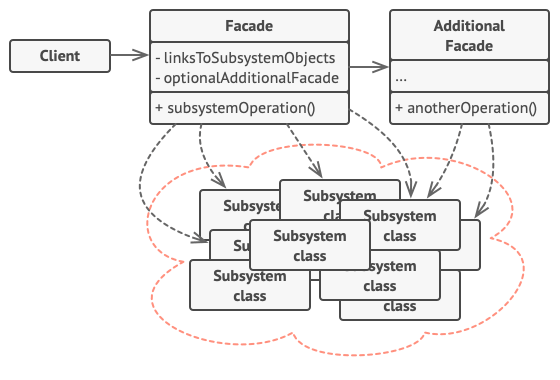

# Structural design patterns
They explain how to assemble objects and classes into larger structures, while keeping these structures flexible and efficient.

## Adapter
**Allows objects with incompatible interfaces to collaborate.**

### 🚨 The problem
aaa

### ✅ The solution
aaa

### 🛠️ Structure
aaa

### 💡 Applicability
aaa

### ⚖️ Pros & Cons
| Pros | Cons |
| ---- | ---- |
| aaaa | aaaa |

 

## Bridge

### 🚨 The problem
**Lets you split a large class or a set of closely related classes into two separate hierarchies (abstraction and implementation) which can be developed independently of each other.**

### ✅ The solution
aaa

### 🛠️ Structure
aaa

### 💡 Applicability
aaa

### ⚖️ Pros & Cons
| Pros | Cons |
| ---- | ---- |
| aaaa | aaaa |

 

## Composite
**Lets you compose objects into tree structures and then work with these structures as if they were individual objects.**

### 🚨 The problem
aaa

### ✅ The solution
aaa

### 🛠️ Structure
aaa

### 💡 Applicability
aaa

### ⚖️ Pros & Cons
| Pros | Cons |
| ---- | ---- |
| aaaa | aaaa |

 

## Decorator
**Lets you attach new behaviors to objects by placing these objects inside special wrapper objects that contain the behaviors.**

### 🚨 The problem
aaa

### ✅ The solution
aaa

### 🛠️ Structure
aaa

### 💡 Applicability
aaa

### ⚖️ Pros & Cons
| Pros | Cons |
| ---- | ---- |
| aaaa | aaaa |

 

## Facade
**Provides a simplified interface to a library, a framework, or any other complex set of classes.**

### 🚨 The problem
Imagine that you must make your code work with a broad set of objects that belong to a sophisticated library or framework. Ordinarily, you’d need to initialize all of those objects, keep track of dependencies, execute methods in the correct order, and so on.

As a result, the business logic of your classes would become tightly coupled to the implementation details of 3rd-party classes, making it hard to comprehend and maintain.

### ✅ The solution
A facade is a class that provides a simple interface to a complex subsystem which contains lots of moving parts. A facade might provide limited functionality in comparison to working with the subsystem directly. However, it includes only those features that clients really care about.

Having a facade is handy when you need to integrate your app with a sophisticated library that has dozens of features, but you just need a tiny bit of its functionality.

For instance, an app that uploads short funny videos with cats to social media could potentially use a professional video conversion library. However, all that it really needs is a class with the single method `encode(filename, format)`. After creating such a class and connecting it with the video conversion library, you’ll have your first facade.

### 🛠️ Structure

- The Facade provides convenient access to a particular part of the subsystem’s functionality. It knows where to direct the client’s request and how to operate all the moving parts.
- Additional Facade classes can be created to prevent polluting a single facade with unrelated features that might make it yet another complex structure; they can be used by both clients and other facades.
- The Complex Subsystem consists of dozens of various objects. To make them all do something meaningful, you have to dive deep into the subsystem’s implementation details, such as initializing objects in the correct order and supplying them with data in the proper format. Subsystem classes aren’t aware of the facade’s existence. They operate within the system and work with each other directly.
- The Client uses the facade instead of calling the subsystem objects directly.

### 💡 Applicability
Use the Facade pattern when:
- you need to have a limited but straightforward interface to a complex subsystem
- you want to structure a subsystem into layers

### ⚖️ Pros & Cons
| Pros | Cons |
| ---- | ---- |
| You can isolate your code from the complexity of a subsystem | A facade can become a "god object" coupled to all classes of an app |

 

## Flyweight
**Lets you fit more objects into the available amount of RAM by sharing common parts of state between multiple objects instead of keeping all of the data in each object.**

### 🚨 The problem
aaa

### ✅ The solution
aaa

### 🛠️ Structure
aaa

### 💡 Applicability
aaa

### ⚖️ Pros & Cons
| Pros | Cons |
| ---- | ---- |
| aaaa | aaaa |

 

## Proxy
**Lets you provide a substitute or placeholder for another object. A proxy controls access to the original object, allowing you to perform something either before or after the request gets through to the original object.**

### 🚨 The problem
aaa

### ✅ The solution
aaa

### 🛠️ Structure
aaa

### 💡 Applicability
aaa

### ⚖️ Pros & Cons
| Pros | Cons |
| ---- | ---- |
| aaaa | aaaa |

 
 

---

Images sources: https://refactoring.guru/design-patterns/
