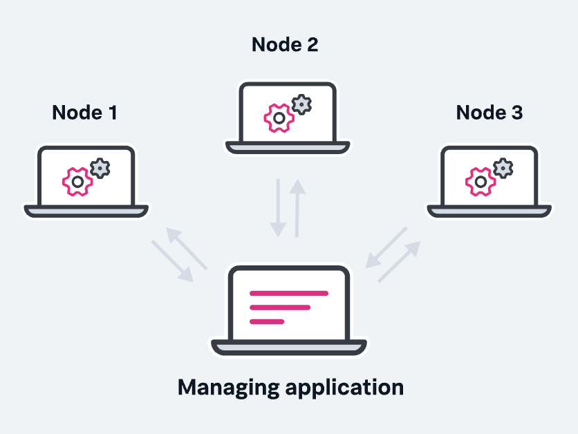
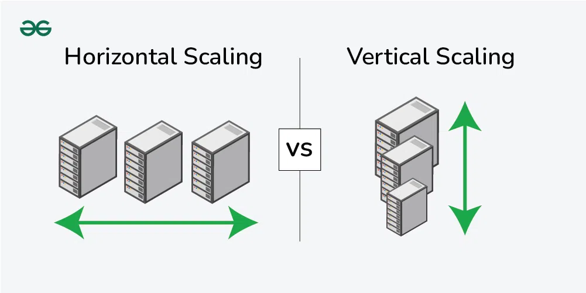
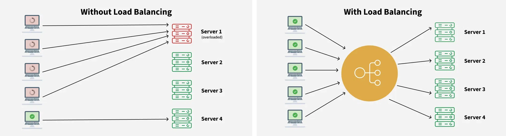

# Distributed systems

Distributed systems generally consist of multiple interconnected devices or computers that work together to perform a task that is beyond the capacity of a single system. These systems work by collaborating, sharing resources and coordinating processes to handle complex workloads. 

*[(Image source)](https://www.splunk.com/en_us/blog/learn/distributed-systems.html)*

### Types
There are many models and architectures of distributed systems in use today. Most common:
- **Client-server architecture**, the most traditional and simple type of distributed system, involve a multitude of networked computers that interact with a central server for data storage, data processing, or other common goal.
- **Multi-Tier architecture**: Builds on client-server by further dividing server roles, isolating data processing and management tasks to separate nodes for efficiency and scalability.
- **Peer-to-peer architecture** distribute workloads among hundreds or thousands of computers all running the same software. Every node has the full application stack, offering high redundancy. Nodes synchronize with each other, ensuring system persistence even if some nodes fail.

### Key characteristics
- **Scalability**. The ability to grow as the size of the workload increases is an essential feature of distributed systems, accomplished by adding additional processing units or nodes to the network as needed.
- **Concurrency**. Distributed system components run simultaneously. They’re also characterized by the lack of a “global clock,” when tasks occur out of sequence and at different rates.
- **Availability and fault tolerance**. If one node fails, the remaining nodes can continue to operate without disrupting the overall computation.
- **Heterogeneity**. In most distributed systems, the nodes and components are often asynchronous, with different hardware, middleware, software and operating systems. This allows the distributed systems to be extended with the addition of new components.
- **Replication**. Distributed systems enable shared information and messaging, ensuring consistency between redundant resources, such as software or hardware components, thus improving fault tolerance, reliability, and accessibility.
- **Transparency**. The end user sees a distributed system as a single computational unit (a single app) rather than as its underlying parts, allowing users to interact with a single logical device rather than being concerned with the system’s architecture.

 

## Scalability
Scalability refers to the ability to grow or expand something efficiently while maintaining the performance. Scalability is about handling growth while preserving or enhancing performance and reliability. It’s not just about “getting bigger”, it’s about doing so in a way that aligns with your goals ensuring a seamless experience for everyone involved. 

There are different strategies to this.

*[(Image source)](https://media.geeksforgeeks.org/wp-content/uploads/20240208100939/hvs-v.webp)*

### Vertical Scaling (scaling up)
It refers to adding more power (CPU, RAM, Storage) to your existing servers. While this can be a quick solution to handle a growing workload but it is limited to certain extent of the server. It can’t go beyond at certain limit. Sometimes it could be an expensive solution and may requires downtime for upgrades. Vertical Scaling are simple to implement without much changes required in the system architecture, however it is limited by hardware constraint and single point of failure.

Examples: 
- Upgrading a database server from 16 GB RAM to 64 GB RAM.
- Moving from a single-core processor to a multi-core processor.

### Horizontal Scaling (scaling out)
This means adding more instances or nodes to your system and distributing the load on multiple nodes. By doing this, organizations can handle increased demand efficiently, ensure high availability, and minimize the risk of bottlenecks. With horizontal scaling you can get virtually unlimited scalability with High availability and Fault tolerance, but it requires changes in the architecture like load balancing, maintaining sync nodes etc. Horizontal scaling is also more cost-effective and elastic (dynamic scaling up or down based on demand is easier)

Examples:
- Adding more servers to a web server cluster to handle additional requests
- Sharding a database to distribute data across multiple machines.

### Diagonal Scaling
A hybrid approach that combines vertical and horizontal scaling. Start by scaling vertically to a threshold, then scale horizontally as needed.

 

## Database scaling
When an application increase it user base, the database can struggle to handle the increasing load, resulting in slower response times, longer query execution, and eventual system crashes. Traditional relational databases tend to show their limits in terms of scalability as they reach hardware limits (CPU, disk, memory).

Scaling a database means increasing read/write traffic, handling larger data volumes properly, having high availability and fault tolerance. 

### 1. Sharding (distributing data across multiple servers)
Sharding is a database partitioning technique where data is split into smaller, more manageable chunks (called shards) and stored across multiple servers. Each shard holds a subset of the data, and together, they make up the complete dataset (e.g. one could shard user data based on their geographical region).

| Benefits | Challenges |
| -------- | ---------- |
| Fault isolation: if one shard goes down, only a portion of the data and requests is affected | More complexity: querying across multiple shards, managing shard key selection, and handling resharding (moving data between shards) require careful planning |
| Optimized query performance: shards operate on reduced datasets | Data skew: if shards are not evenly distributed, some servers might be overloaded while others remain underutilized |
| Horizontal scalability |  |

### 2. Replication (ensuring high availability and load balancing)
Replication involves copying data from one database (called the primary) to one or more databases (called replicas). The replicas act as backups and can also be used to distribute read traffic.

A typical setup is master-slave (or primary-replica) replication:
- Primary database: handles all write operations.
- Replica databases: handle read operations, reducing the load on the primary database.

| Benefits | Challenges |
| -------- | ---------- |
| High availability: replicas can be promoted to primary db if needed | Handling failover: promoting a replica to a primary during an outage needs careful coordination, especially in avoiding split-brain scenarios (where two databases mistakenly assume they’re both primaries) |
| Fault tolerance: replication provides real-time backups of primary db | Replication Lag: there’s often a slight delay between writing data to the primary db and propagating it to the replicas. This can lead to inconsistencies for read-heavy applications where real-time data is critical |
| Load distribution |  |

### 3. Caching (reducing database load and improving latency)
Caching involves storing frequently accessed data in a faster, temporary storage layer (typically in-memory) to reduce the load on the database and improve response times.

(e.g. an in-memory data store like Redis can be used for caching). 

| Benefits | Challenges |
| -------- | ---------- |
| Improved Latency: by caching frequently accessed data, we significantly reduced query response times, as the cache is faster than querying the database | Cache Invalidation: ensuring the cache is always up-to-date is tricky If the data in the cache becomes outdated, it can lead to users seeing stale information |
| Reduced Load on the Database: with fewer queries hitting the database, its overall performance improved, allowing it to focus on more critical tasks | Cache Misses: if the data is not in the cache (cache miss), the application still needs to query the database, potentially causing a performance drop |
| Cost Efficiency: by serving data from the cache, we were able to reduce the need for additional database instances, saving on infrastructure costs |  |

 

## Load balancing

Load balancing is the process of distributing incoming network traffic across a set of resources, ensuring the performance and reliability of the system. This provides the flexibility to add or subtract resources as demand dictates.

*[(Image source)](https://www.geeksforgeeks.org/what-is-load-balancer-system-design/)*

There are three main problems that it solves:

- Single Point of Failure: if the server goes down or something happens to the server the whole application would be interrupted and it would become unavailable for the users for a certain period
- Overloaded Servers: there would be a limitation on the number of requests that a web server can handle
- Limited Scalability: without a load balancer, adding more servers to share the traffic is complicated. All requests are stuck with one server, and adding new servers won’t automatically solve the load issue

A load balancer can sit in front of the servers and direct client requests across all servers capable of serving them, optimizing speed and capacity use. This prevents one server from getting too busy and slowing down. If a server goes down, the load balancer redirects traffic to the remaining online servers. When we add a new server, the load balancer automatically starts sending requests to it.

### Algorithms
We need a load-balancing algorithm to decide which request should be redirected to which backend server.

- **Static Load Balancing Algorithms** involves predetermined assignment of tasks or resources without considering real-time variations in the system. This approach relies on a fixed allocation of workloads to servers or resources, and it doesn't adapt to changes during runtime. Might work well in situations that are more predictable
    - Round Robin
    - Weighted Round-Robin
    - Source IP hash

- **Dynamic Load Balancing Algorithms** make judgments in real time, regarding the distribution of incoming network traffic or computing burden among several servers or resources. This method adjusts to the system's shifting circumstances, including changes in resource availability, network traffic, and server load
    - Least Connection Method
    - Least Response Time Method
